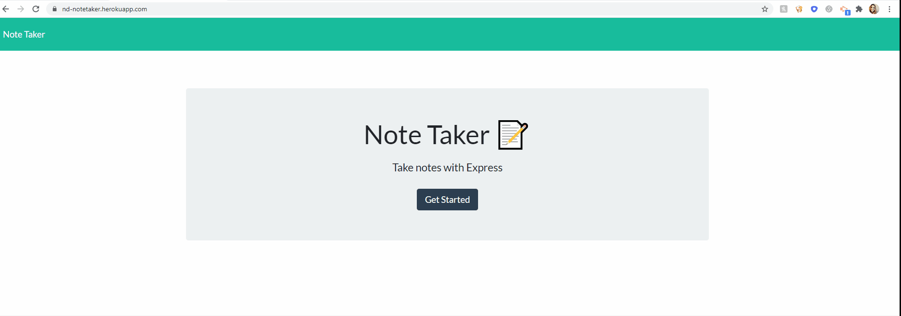

#  Note Taker App

## Description

This application can be used to write, save, and delete notes. This application will use an express backend and save and retrieve note data from a JSON file.

## Table of Contents
  * [Installation](#installation)
  * [Build](#build)
  * [Demo](#demo)
  * [Usage](#usage)
  * [Contact](#contact)

## Installation

Clone repo 

Install dependencies using "npm i"

Run the application using "node server.js"

Open localhost:8080 in your browser

## Build

Built using:
* JavaScript
* jQuery
* Node.js
* Express.JS
* ShortId NPM
* Bootstrap
* Font Awesome

## Demo

## Use

This project can be used by anyone who wants to save a note to be retrieved in the future. Users start by clicking the "Get Started" button on the home page. Enter in a note "Title" and note "Text" in the fields. A "Save" button will appear in the nav bar. Click this button to save the note. Saved notes will appear on the left hand side of the screen. To delete a note, click the trashcan icon of the given note.

## Contact

Nadine Delaire :  ndelaire16@gmail.com
Repo: https://github.com/ndelaire/notetaker

